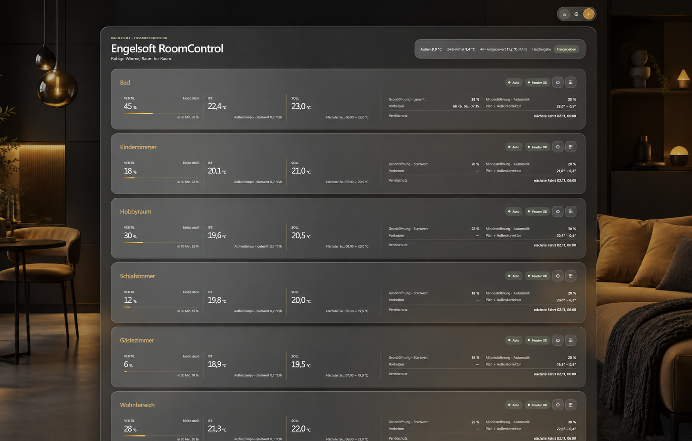
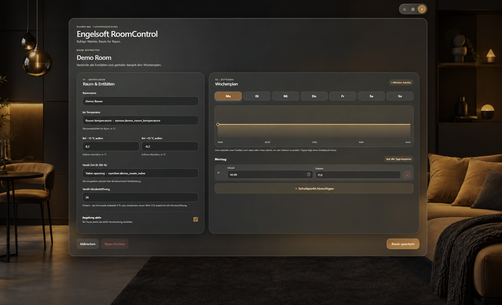

# Engelsoft RoomControl

**A room-by-room brain for slow underfloor heating, wrapped in a calm Home Assistant interface.**

RoomControl is a local custom integration for hydronic floor heating. It gives every room its own weekly schedule and adaptive valve controller, while a polished glass-style panel makes the decisions visible: current and target temperature, valve opening, heating status, upcoming schedule changes, and the controller's reasoning at a glance.

> **Pre-release:** This is an early public build. The control logic has local automated tests, but installation and behavior with real Home Assistant entities and heating hardware have not yet been verified here. Check the resulting valve commands before relying on it.

## A dashboard built for the whole home

Each room card brings together essential live values and a short explanation of what the controller is doing. Cards can be reordered with a mouse, touch, or keyboard. The panel supports light and dark glass styling, and its controls open related Home Assistant entities directly.

## Shape the week, minute by minute

The room editor connects a temperature sensor and a 0–100% `number` valve target. Its visual weekly schedule lets you add switching points, drag temperature segments, edit time to the minute and target temperature to 0.1 °C, and copy a day across the week.

*The images are anonymized illustrative edits of the provided screenshots. Room names, entity IDs, readings, and schedules shown in them are fictional; the actual panel language in this build is German.*

## More than a thermostat

RoomControl is designed around the long response time of underfloor heating:

- **Adaptive room control.** A slow PI controller combines a learned baseline valve opening with gentle corrections, smoothing temperature readings and limiting normal valve changes to five percentage points per 15 minutes.
- **Predictive preheating.** Each room learns its warming rate and can start before the next scheduled temperature rise, with a safety margin and an eight-hour cap.
- **Outdoor-aware targets and heating permission.** A rolling 24-hour outdoor average can adjust room setpoints. A separate outdoor-temperature threshold with hysteresis can enable or disable heating across all rooms.
- **Practical valve behavior.** An optional minimum opening avoids ineffective low valve positions. Hysteresis and minimum open/close times reduce frequent switching.
- **Transparent, persistent learning.** Baseline opening and warming rate change only after sufficiently stable observations, in small steps. Learned values and operating state survive Home Assistant restarts.
- **Useful safeguards.** Weekly valve exercise, missing-entity handling, manual valve control with a two-hour automation pause, and a probable-open-window indicator help make day-to-day operation understandable.

The panel also shows the next schedule transition and a 30-minute *valve-position projection*. That projection describes the controller's expected output under unchanged conditions; it is not a room-temperature forecast. A probable-open-window alarm is informational and does not itself stop valve control.

## Install this pre-release

1. Download the ZIP asset from the latest pre-release.
2. Extract it into your Home Assistant configuration directory so the files land at `/config/custom_components/room_thermostat/`.
3. Restart Home Assistant.
4. Open **Settings → Devices & services → Add integration** and select **Engelsoft RoomControl**.
5. Open **Engelsoft RoomControl** in the sidebar. Choose an outdoor temperature sensor in central settings if desired, then add each room's temperature sensor and a valve target exposed as a `number` entity supporting 0–100.

The sidebar panel is available to Home Assistant administrators. RoomControl writes valve percentages through `number.set_value`; its calculated temperature setpoint is displayed separately.

## What to expect from an early build

This integration currently uses a German panel. Its predictive start is an estimate based on observed warming; weather, sunshine, and floor inertia can shift the actual warm-up time. The reported `number` value confirms the entity state, not the mechanical movement of a valve. Always verify your own sensors, valve direction, and limits before relying on automatic heating.

## Development

The integration lives in [`custom_components/room_thermostat`](custom_components/room_thermostat). Controller and lifecycle checks are in [`tests`](tests). These local checks do not replace a running Home Assistant test.

This project is not affiliated with or endorsed by Home Assistant.
